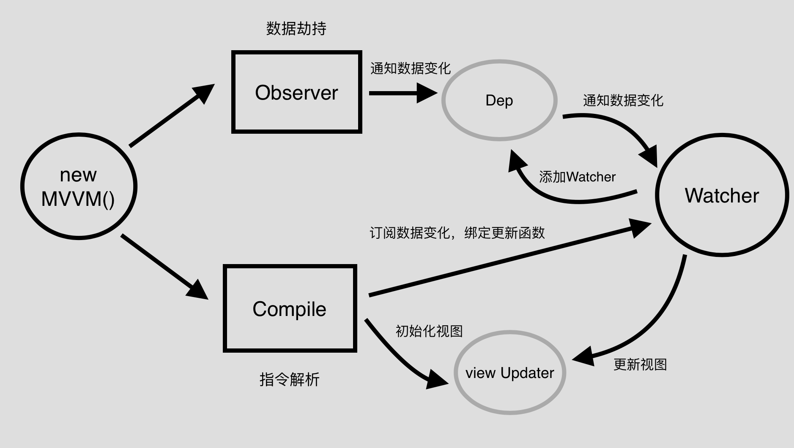

# MyVue
已学习为目的，实现一个自己的mvvm思想类vue框架


## Table of Contents

[TOC]


## 思路分析



- 实现一个Compile，对指令进行解析，初始化视图，并且订阅数据的变更，绑定好更新函数
- 实现一个Observer，对数据进行劫持，通知数据的变化
- 实现一个Watcher，将其作为以上两者的一个中介点，在接收数据变更的同时，让Dep添加当前Watcher，并及时通知视图进行update
- 实现MVVM，整合以上三者，作为一个入口函数


## STEP1

步骤1， 此章节主要实现Complier编译器和MVVM构造函数的主要逻辑

- MVVM
- Compiler


### MVVM

- 传入el， data等 options参数

  ```js
  new MVVM({
      el: '#app',
      data() {...}
  })
  ```

- 调用Complier构造函数, 编译dom


### Complier

- 通过选择器找到根节点，保存el到自身实例, 保存mvvm单例对象

  ```js
  this.el = document.querySelector(el)
  this.vm = vm
  ```

- 创建fragment文档片段并把原始el dom元素的所有子节点增加到 fragment并返回

  ```js
  let fragment = document.createDocumentFragment()
  let firstChild
  while (firstChild = el.firstChild) {
      fragment.appendChild(firstChild)
  
  }
  return fragment
  ```


## STEP2

步骤2， 此章节在步骤1的基础上完善了compiler的逻辑功能

- MVVM
- Compiler


### Compiler

Compiler 编译器， 把传入的fragment

- **constructor**

  - 绑定el， 和 vm实例， 便于之后使用

    ```js
    this.el = document.querySelector(el)
    this.vm = vm
    ```

  - 把 el 的所有子节点推入 fregment  并从 dom 移除

    ```js
    let fragment = this.toFragment(this.el)
    ```

  - 编译 fragment 

    ```js
    this.compile(fragment)
    ```

  - 把编译后的 fragment 重新放入 dom

    ```js
    this.el.appendChild(fragment)
    ```

- **toFragment**

  创建fragment文档片段并把原始el dom元素的所有子节点增加到 fragment并返回

  ```js
  let fragment = document.createDocumentFragment()
  let firstChild
  while (firstChild = el.firstChild) {
      fragment.appendChild(firstChild)
  }
  return fragment
  ```

- **compile**

  **编译器函数**， 传入节点， 循环遍历子节点， 如果子节点是非文本元素就**递归调用自身**和对应编译非文本节点的逻辑函数， 如果是文本节点就调用编译文本节点的函数

  ```js
  compile(parentNode) {
      let childNodes = parentNode.childNodes
      console.log('childNodes is', childNodes)
      childNodes.forEach((node, index) => {
          if (this.isElement(node)) {
              this.compile(node)
              this.compileNode(node)
          } else if (this.isText(node)) {
              this.compileText(node)
          }
      })
  }
  ```

- **compileNode**

  编译元素节点，把元素的属性放入数组中过滤出带有v-前缀的属性名组成的数组， 调用相应的函数处理对应指令的逻辑功能。

  **主要API**

  - **node.getAttributeNames()** 返回所有node属性名的数组例如 ['id', 'class', 'v-model']
  - **node.getAttribute(attrname)**  获取节点对应的属性值 

  ```js
   compileNode(node) {
          let attrs = node.getAttributeNames()
          // 把已v-指令存到一个数组中
          attrs = attrs.filter(this.isDirective)
          attrs.forEach((item) => {
              let value = this.splitData(node.getAttribute(item), this.vm.$data)
              if (compileUtil[item]) {
                  compileUtil[item](value, node)
              } else {
                  console.warn(`can't find directive ${item}`)
              }
          })
      }
  ```

- **compileText**

  **编译文本节点函数**, 取出文本节点带有{{message}}的属性做替换， 并把替换后的值插入node

  替换文本节点内容api :  **node.textContent = value**

  ```js
  compileText(node) {
      // 测试文本节点含有 {{val}} 的 regexp
      let reg = /\{\{([^}]+)\}\}/g
      // 拿到文本节点的文本值
      let text = node.textContent
      if (reg.test(text)) {
          // 去掉{{}} 保留 value
          let attrName = text.replace(reg, (...args) => {
              return args[1]
          })
          let textValue = this.splitData(attrName, this.vm.$data)
          compileUtil.updateText(textValue, node, this.vm)
      }
  }
  ```

- **splitData**

  **迭代取值器**， 把形如 'group.member.age'这样的字符串找到 $data上的对应的值并返回,

  **主要api**： **array.reduce**

  ```js
  splitData(attr, data) {
      // 传入 attr 形如 'group.member.name', 找到$data上对应的属性值并返回
      let arr = attr && attr.split('.')
      let ret = arr.reduce((prev, next) => {
          return prev[next]
      }, data)
      return ret
  }
  ```


## STEP3

步骤3， 此章节在步骤1, 2的基础上， 新增加 Observer类实现数据劫持

- MVVM 
- Compiler
- Observer 


### Observer

Observer 观察者， 对数据进行劫持， 对data的每一个属性设置 getter和setter， 用来数据发生变动时通知观察者触发视图更新


- **observer**

  数据观察器， 遍历对象属性， 设置属性为响应式

  ```js
  observer(data) {
      // 递归的终止条件： 当观察数据不存在或不再是对象是停止
      if (!data || typeof data !== 'object') {
          return
      }
      Object.keys(data).forEach(key => {
          // 递归调用自身， 深层遍历对象属性
          this.observer(data[key])
          // 调用响应式函数， 设置响应式属性
          this.setReactive(data, key)
      })
  }
  ```

- **setReactive**

  设置响应式的函数， 对数据进行劫持， 设置getter和setter，当get时订阅消息， 当set时发布通知

  ```js
  setReactive(data, key) {
      let _this = this
      Object.defineProperty(data, key, {
          enumerable: true,
          configurable: true,
          get(value) {
              // 进行订阅
              return value
          },
          set(newValue) {
              if (newValue !== data[key]) {
                  // 设置新值， 新值没有进行过响应式处理， 所以要重新observer
                  data[key] = newValue
                  _this.observer(data[key])
                  // 发布通知
              }
          }
      })
  }
  ```